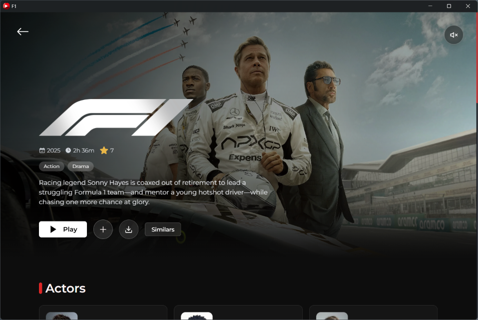
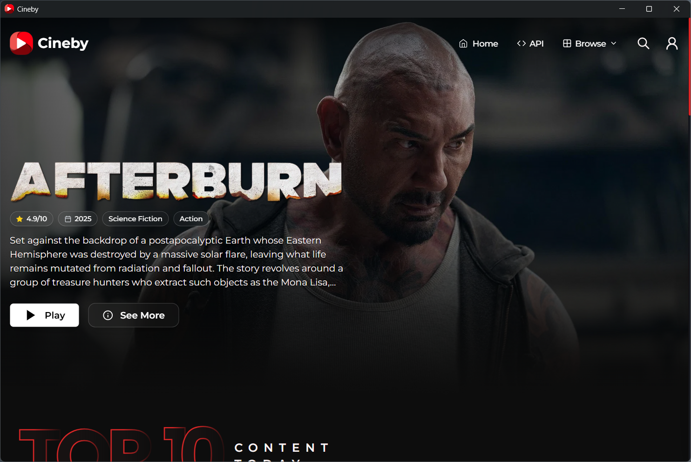
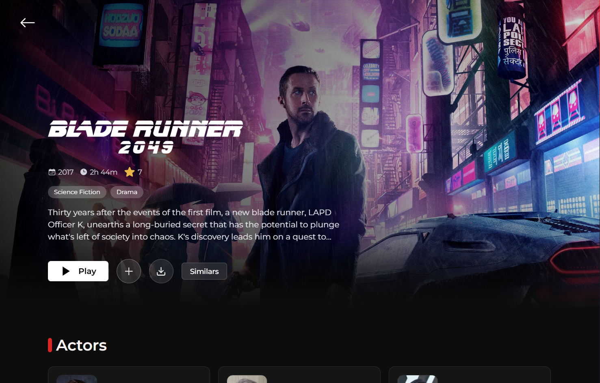
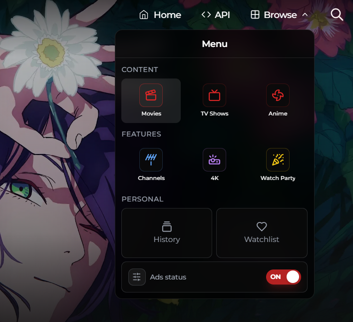
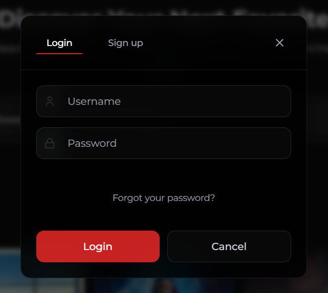

# Cineby Home Theater

         
        <i style="font-size: 10px; color: currentColor;">
            <a href="https://www.electronjs.org/" style="color: currentColor; text-decoration: none;">Powered by Electron</a>
        </i>

¡Hola a todos! Me emociona anunciar la primera versión estable de **Cineby Home Theater**, una aplicación de escritorio diseñada para ofrecerte la mejor experiencia de cine en casa.

Esta aplicación envuelve la web de Cineby.app en un entorno dedicado de escritorio (Electron), asegurando una experiencia de usuario limpia, dedicada y sin distracciones.

---

## ✨ Características Principales

* **Experiencia sin distracciones:** Marco de ventana nativo para una integración perfecta en el escritorio (Windows/Linux).
* **Controles funcionales:** Botones de minimizar, maximizar y cerrar provistos por el sistema operativo.
* **Navegación segura:** Bloqueo de ventanas emergentes externas para mantener el foco en el contenido de Cineby.app.
* **Rendimiento optimizado:** Construido sobre la base rápida de Electron.

---

## 📸 Screenshots

    

        
        
    

    

        
        
    

    

        
        
    

---

## ⬇️ Descargas

Descarga el instalador correspondiente a tu sistema operativo.  
↓↓↓↓↓↓↓↓ 
https://github.com/DionelValera/cineby-web-app/releases/tag/stable-release

### 💻 Windows

* **Instalador:**
[cineby-web-app-v1.0.exe](https://github.com/DionelValera/cineby-web-app/releases/download/stable-release/Cineby-Setup-1.0.exe)

### 🐧 Linux

* **AppImage:**

({MUY PRONTO})

*(Recuerda dar permisos de ejecución al archivo después de descargarlo.)*

### 📱 Android y Android TV 

* **Apk:**

({MUY PRONTO})

---

## 🛠️ Instalación y Uso

1.  Descarga el archivo correspondiente a tu sistema.
2.  **Windows (.exe):** Ejecuta el instalador y lo encontrarás instalado!
3.  **Linux (AppImage):** usar un manager de appimage para su correcto uso; o también: Click derecho > Propiedades > Permisos > Marcar como ejecutable. Luego, haz doble clic.
4.  ¡Disfruta de tus películas sin interrupciones!

---

## 🤝 Contribuciones

Si encuentras algún *bug* o tienes alguna sugerencia, por favor, abre un *issue* en este repositorio.

¡Gracias por el apoyo!
